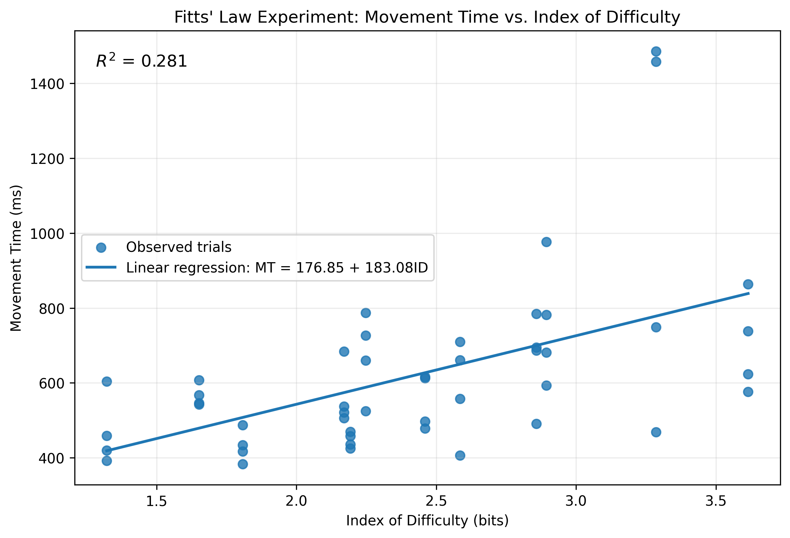

# AI-Assisted Fitts' Law Experiment

## 1. Scenario

This experiment simulates an automotive touchscreen interface used by a driver to control functions such as climate and media settings.

The scenario was chosen because touchscreen controls in vehicles need to be selected quickly and accurately. Long interaction times may increase the amount of time a driver needs to interact with the display and potentially increase distraction.

## 2. Innovation

The experiment introduces a visual target guidance cue.

A subtle guidance ring appears around the target to help users locate the target quickly. The interface is designed to resemble a modern automotive infotainment system rather than a traditional Fitts' Law experiment with simple geometric shapes.

The purpose of this design is to investigate Fitts' Law in a more realistic automotive touchscreen context.

## 3. AI-Assisted Prototyping

Generative AI was used as a rapid-prototyping partner to develop the experimental application.

The AI-generated application was implemented as a single HTML file containing HTML, CSS, and JavaScript. The application systematically varies target distance and target width, records movement time using a high-resolution timer, and exports the collected data as a CSV file.

## 4. Experimental Design

The experiment consisted of 48 experimental trials preceded by one practice trial.

Target distance (A) was varied across:

- 150 pixels
- 250 pixels
- 350 pixels
- 450 pixels

Target width (W) was varied across:

- 40 pixels
- 70 pixels
- 100 pixels

There were 12 unique combinations of A and W, and each combination was repeated four times.

The Index of Difficulty was calculated using the Shannon formulation:

ID = log2(A / W + 1)

Movement Time (MT) was measured from the appearance of the target until the participant successfully clicked the target.

## 5. Empirical Results

A total of 48 valid trials were collected.

Linear regression was performed using:

MT = a + b × ID

The resulting parameters were:

- Intercept (a) = 176.85 ms
- Slope (b) = 183.08 ms/bit
- R² = 0.281

Therefore, the empirical Fitts' Law model is:

**MT = 176.85 + 183.08 × ID**

The intercept of 176.85 ms represents the basic time associated with initiating and completing a pointing movement, independent of target difficulty.

The slope of 183.08 ms/bit indicates that Movement Time increases by approximately 183 ms for every additional bit of Index of Difficulty.

The R² value of 0.281 indicates that the Index of Difficulty explains approximately 28.1% of the variation in Movement Time in this experiment.

Factors such as individual motor ability, reaction time, touchscreen familiarity, attention, fatigue, and hand positioning may cause these parameters to vary between users.

## 6. Results Visualization

The scatter plot below shows the relationship between Index of Difficulty and Movement Time, together with the linear regression trendline.

## 7. Experiment Video

The screen recording of the experimental session is available here:

[Watch the Fitts' Law Experiment on YouTube](https://youtu.be/u8uVtahrTpU)

## 8. Live Experiment

The interactive experiment is available through GitHub Pages:

[Launch the Fitts' Law Experiment](https://yushan0806.github.io/fitts-law-automotive-experiment/)
